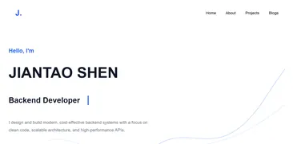

## Description
My personal portfolio website built with React. It showcases my projects, skills, and background through a clean and responsive user interface.

## Features
- Responsive design
- Client-side routing with React Router
- Clean and simple UI design

## Tech Stack
- React
- React Router
- TypeScript
- Vite
- Tailwind CSS
- CSS Modules

## Architecture
The project structure separates pages, styles, and layouts into different folders to improve maintainability and scalability. It uses both Tailwind CSS and CSS Modules to minimize the number of CSS files in the project, making it possible to store all pages in a single folder without confusing developers.

Page Route → jsx 

- `/about` → `about.jsx` 
- `/projects` → `projects.jsx` 
- `/` → `home.jsx` 
- `/projects/:id` → `projectDetail.jsx` 

This structure makes the project easier to maintain and navigate. When updates are needed, it is easier to identify where changes should be made.

`App.jsx` is used as the main routing component, while global stylesheets called `theme.css` and `global.css` manages the overall website theme and styling.

## Future Improvements
- Improve responsive design for more screen sizes
- Improve accessibility
- Add Swedish and Chinese language support

## Q&A

### Q: Why is the text written directly in the code instead of being loaded from a JSON file?

Most of the website content is static and rarely changes. Storing the text directly in the code reduces unnecessary data fetching and simplifies the project structure. Since updates are usually made together with webpage changes, this approach provides better simplicity and slightly improved performance compared to loading content from external JSON files.

### Q: Why doesn’t the webpage have cool or advanced UI effects?

The webpage doesn’t include many advanced UI effects because the main audience is HR professionals. What they want to know is who I am and why they should hire me. The most important part for them is the projects I have created.

Cool effects may surprise or impress some people, but not every HR professional likes that kind of experience. HR staff often review many candidates, so they do not want to spend too much time looking at visual effects. As a result, they may miss important details.

A simple design avoids this problem. HR professionals can quickly find the information they need without guidance, so they are less likely to miss anything important.

### Q: Why do you use AI, and how do you use it?

From my perspective, AI is a powerful tool for increasing productivity. Before AI became widely available, creating a prototype could take up to a week. Now, it can often be completed within two days. This is a significant improvement in development efficiency.

I use AI to help create prototypes based on my designs. The development process for this project was:

1. I designed the requirements and structure of the webpage.
2. AI generated the initial code based on those requirements.
3. I worked together with AI to identify and fix bugs in the code.
4. I optimized and maintained the code to improve performance and readability. For example, I removed duplicate classes across different CSS files.

I also use AI when writing documentation. I first create an abstract summary or draft, and then AI helps rewrite it in a more professional and polished way.

## Updates 
Here shows the most important updates for the portfolio pages

### Version 1
A simple CV pages looks like this: ["https://jiantaoshen.github.io/CV_Page"](https://jiantaoshen.github.io/CV_Page/).

### Version 2
Redesign the UI with help of AI. Also change deployed from Github page to Vercel. Looks like follow images:

### Version 3
Important changes:
- Remove bar plot in '/About' because the plot doesn't give any information. 
- Remove background in '/' and display my projects instead.
- Change CSS to CSS Modules and Tailwind CSS
- Change Javascript to Typescript (JSX -> TSX)

